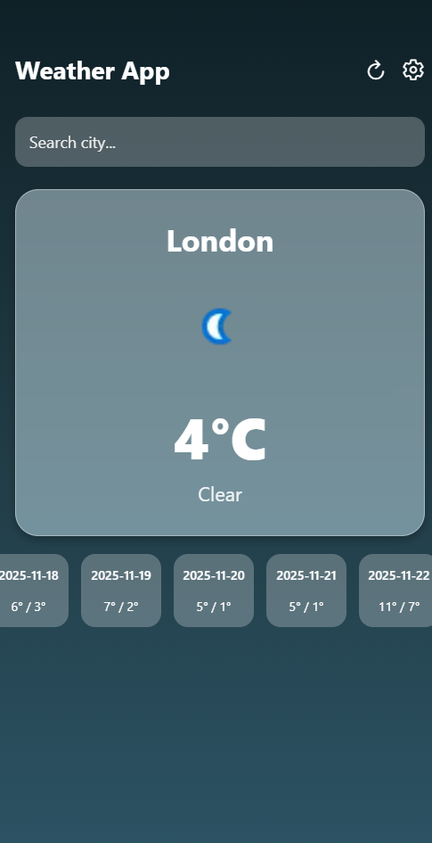

# 🌦️ Weather App (React Native + Expo)

A modern weather app built with **React Native**, **Expo**, and **WeatherAPI.com**.
It provides real-time weather data, a 7-day forecast, animated icons, and a wind-direction compass—all inside a smooth, mobile-friendly UI.

---

## 🚀 Features

* Real-time temperature, condition, wind, and more
* Search weather by city
* 7-day forecast UI
* Dynamic weather-based gradients
* Glassmorphic weather card
* Animated weather icons
* Settings screen with expandable sections

---

## 🛠 Tech Stack

* **React Native + Expo**
* **WeatherAPI.com**
* **Expo Router**
* **React Native Reanimated**
* **React Native SVG**
* **Expo Location**

---

## 📦 Installation

```bash
npm install
```

Add your WeatherAPI key in `weatherApi.ts`:

```ts
const API_KEY = "YOUR_KEY";
```

Run the app:

```bash
npx expo start
```

---

## 👨‍💻 Developer

**Developed by Suleman Sadat**
Focused on learning, UI/UX practice, and clean mobile architecture.